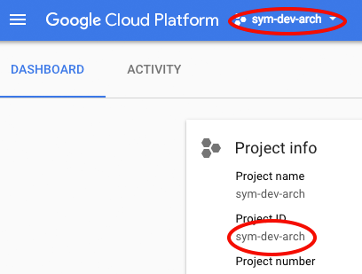
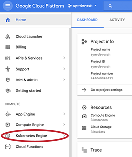

# Google Cloud Environment Setup
Point your web browser to the [Google Cloud Platform Console](https://console.cloud.google.com), look near the top left corner of the page for the project selector, the project name shown in this screen shot is **sym-dev-arch**.



If the correct project is not listed then talk to your project lead to have yourself added to the project.

If the name of the project is globally unique (as it is in the screen shot) then the project ID will be the same as the project name, if not then the project ID will have additional digits added to the name to make it unique. The Project ID is shown in the dashboard section of the GCP Console as shown in the screen shot above. Make a note of the Project ID.

## Install GCloud
If you do not already have it installed, download the gcloud SDK from [https://cloud.google.com/sdk/downloads](https://cloud.google.com/sdk/downloads)

## Install kubectl
Next install **kubectl** (it is safe to execute this command if it is already installed) and set values for various configuration parameters:

```
$ gcloud components install kubectl

All components are up to date.
$ gcloud config set project $PROJECT
Updated property [core/project].
$ gcloud config set compute/region us-central1
Updated property [compute/region].
$ gcloud config set compute/zone us-central1-b
Updated property [compute/zone].
$ gcloud config list
[compute]
region = us-central1
zone = us-central1-b
[core]
account = your.name@your.domain
disable_usage_reporting = True
project = sym-dev-arch

Your active configuration is: [default]
$ 

```

## Setup A Google Cloud Kubernetes Cluster
This would normally be done once, by the tech lead, for any given service.

Choose a name for the cluster, the examples use the name **your-cluster-name**, replace this with a name of your choice and then create a cluster with the following commands:

```
your-cluster-name
$ gcloud container clusters create your-cluster-name
Creating cluster your-cluster-name.../
$ 
```

This process may take several minutes. Once it completes, verify that you have connectivity to the cluster as follows:

```
$ gcloud container clusters list
NAME               LOCATION       MASTER_VERSION  MASTER_IP        MACHINE_TYPE   NODE_VERSION  NUM_NODES  STATUS
your-cluster-name  us-central1-b  1.7.11-gke.1    130.211.131.169  n1-standard-1  1.7.11-gke.1  3          RUNNING
$ gcloud container clusters get-credentials your-cluster-name
Fetching cluster endpoint and auth data.
kubeconfig entry generated for your-cluster-name.
$ kubectl get services
NAME         TYPE        CLUSTER-IP    EXTERNAL-IP   PORT(S)   AGE
kubernetes   ClusterIP   10.31.240.1   <none>        443/TCP   14h
$ 
```

Also check that you can see the cluster in the Google Cloud Console, select **Kubernetes Engine** in the left nav:



and then you should see the cluster, like this:


# Next Steps
The next step is to [Set up the Fugue CLI](../../setupFugueCLI.md)